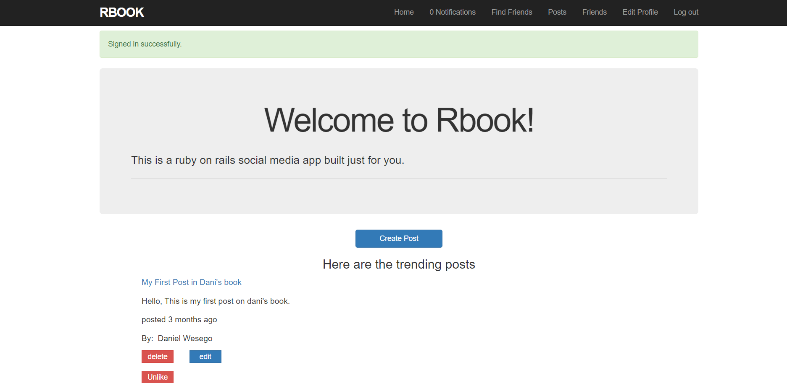

# RailsBook

> A Facebook-like social media app built using Rails. It includes most of the functionalities of Facebook except realtime chat.

## Built With

- Ruby version - 2.6

- Rails 6

- System dependencies - Devise, Omniauth

- Database - Postgresql

## Demo

🔥 [Demo](https://serene-shore-00148.herokuapp.com/)

## Screenshot



## The Database diagram for the project is shown below:


## Getting Started

To get a local copy up and running follow these simple example steps.

 - Clone this repository to your local machine using ```git clone git@github.com:DanielMitiku/Final-Project.git```.

 - Run ```cd Final-Project``` to move into the app directory.
 
 - Run ```bundle install``` to install dependencies.
 
 - Run ```rails db:migrate``` to migrate the database.

 - Run ```rails s``` to run the server.

## Current Features

- User signup and authentication
- User signup using Omniauth 
- Users can send/accept friend requests
- Users can post
- Users can like or comment on posts ...

## Features you can add

- Sending Email 
- making it responsive ...

## Author

- Github: [Daniel Mitiku](https://github.com/DanielMitiku)
- LinkedIn: [@daniel-wesego](https://www.linkedin.com/in/daniel-wesego/)
- Email: wedanielmitiku@gmail.com

## 🤝 Contributing

- Contributions, issues and feature requests are welcome!

- Feel free to create PR.

## Show your support

- Give a ⭐️ if you like this project and follow me on [Github](https://github.com/DanielMitiku) for more projects like this.

## 📝 License

- This project is [MIT](lic.url) licensed.
