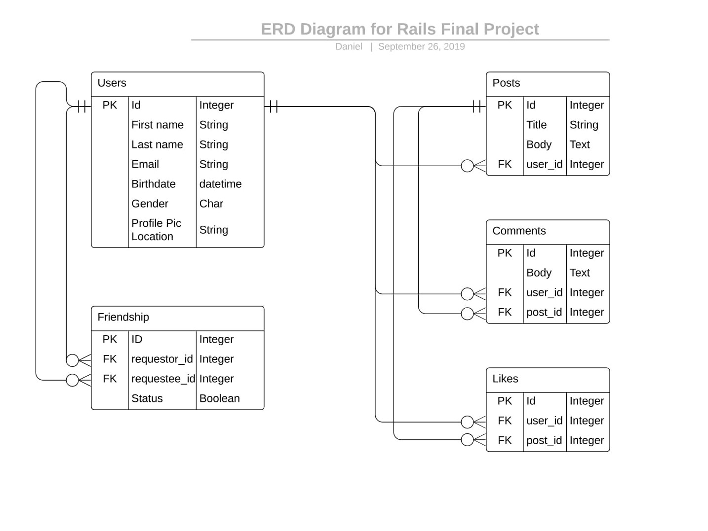

# RailsBook

> This is a Rails Project on a facebook like social media. It has most of the functionalities of facebook except realtime chat.

## Built With

- Ruby version - 2.6

- Rails 6

- System dependencies - Devise, Omniauth

- Database - Postgresql

## Live Demo

- The live version of the app can be found [here](https://serene-shore-00148.herokuapp.com/)

## Getting Started

To get a local copy up and running follow these simple example steps.

 - Clone this repository to your local machine using ```git clone git@github.com:DanielMitiku/Final-Project.git```.

 - Run ```cd Final-Project``` to move into the app directory.
 
 - Run ```bundle install``` to install dependencies.
 
 - Run ```rails db:migrate``` to migrate the database.

 - Run ```rails s``` to run the server.


## Author

👤 **Daniel Mitiku**

- Github: [@danielmitiku](https://github.com/DanielMitiku)

The Database diagram for the project is shown below:

